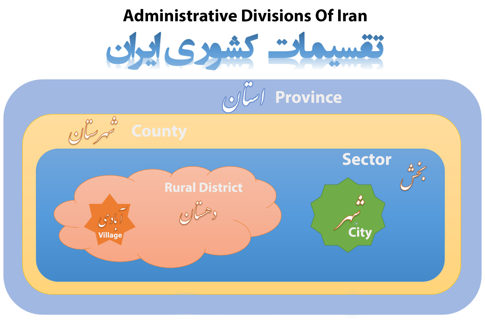

# Typhoon Iran Regions, Provinces, Counties, Cities, City Districts, Rural Districts and Villages


[](https://packagist.org/packages/SaliBhdr/typhoon-iran-cities)
[](https://packagist.org/packages/SaliBhdr/typhoon-iran-cities)
[](https://packagist.org/packages/SaliBhdr/typhoon-iran-cities)
[](https://packagist.org/packages/SaliBhdr/typhoon-iran-cities)

## Introduction

Typhoon Iran Cities is a Laravel package for importing all regions for example provinces, counties, sectors, cities, city districts, rural districts and villages of Iran into your database with just 
only one console command.

This is the most accurate Laravel package for administrative divisions of Iran without a doubt.



**Features**
- All provinces of Iran (استان)
- All counties of Iran (شهرستان)
- All sectors of Iran (بخش)
- All cities of Iran (شهر)
- All city districts of Iran (مناطق شهری)
- All rural districts of Iran (دهستان)
- All villages of Iran (آبادی)
- Compatible with Laravel
- Built-in models of provinces, counties, sectors, cities, city districts, rural districts and villages
- relational database between these tables

## Installation

#### Install with Composer
```sh
 $ composer require salibhdr/typhoon-iran-cities
```
## Getting started

##### Laravel

For Laravel < 5.5 Register the Service provider in your config/app.php configuration file:

---

```
'providers' => [

     # Other service providers...
     
     SaliBhdr\TyphoonIranCities\IranCitiesServiceProvider::class,
],
```

Run `Iran:publish:migrations` command for copying migrations:

```sh

php artisan Iran:publish:migrations

```

It will generate the 7 migration files under database/migrations directory.

```
xxxx_xx_xx_xxxxxx_create_iran_provinces_table.php,
xxxx_xx_xx_xxxxxx_create_iran_counties_table.php,
xxxx_xx_xx_xxxxxx_create_iran_sectors_table.php,
xxxx_xx_xx_xxxxxx_create_iran_cities_table.php,
xxxx_xx_xx_xxxxxx_create_iran_city_districts_table.php,
xxxx_xx_xx_xxxxxx_create_iran_rural_districts_table.php,
xxxx_xx_xx_xxxxxx_create_iran_villages_table.php,

```
Then run `Iran:publish:models` command for copying models (If you don't want to use models skip this part) :

```sh

php artisan Iran:publish:models

```

This will copy `IranProvince.php`, `IranCounty.php`, `IranSector.php`, `IranCity.php`, `IranCityDistrict.php`, `IranRuralDistrict.php` and `IranVillage.php` models.

Run the `php artisan migrate` command to migrate all 7 tables:

## Usage

#### Data Import
At the end for importing data into related tables you can run one of these commands:

```

  iran:import                  Imports all regions into the database (Can be selected by option)
  iran:import:provinces        Imports provinces only into the database
  iran:import:counties         Imports counties and provinces without cities into the database
  iran:import:sectors          Imports sectors, counties and provinces into the database
  iran:import:cities           Imports cities, sectors, counties and provinces into the database
  iran:import:city-districts   Imports city districts, cities, sectors, counties and provinces into the database
  iran:import:rural-districts  Imports rural districts, sectors, counties and provinces into the database
  iran:import:villages         Imports villages, rural districts, sectors, counties and provinces into the database

```

This outputs one or more of these line based on the command :

```

Starting to import data...

Importing provinces...
 31/31 [============================] 100%
Importing counties...
 448/448 [============================] 100%
Importing sectors...
 1099/1099 [============================] 100%
Importing cities...
 1354/1354 [============================] 100%
Importing city districts...
 200/200 [============================] 100%
Importing rural districts...
 2637/2637 [============================] 100%
Importing villages...
  98100/98100 [============================] 100%

Data has been imported successfully!!!

```
#### Code Usage

All Available methods

This package uses 3 eloquent models to get data from the database. These models are Province, County, and City.
Some methods are common among these models, and some are not. 
Here is the list of all these methods with their usages:

**Common Methods for All models**

If you use `HasStatusField` trait these methods are available. By default, the `HasStatusField` is used.

| Method        | Type           | Usage                              |
|---------------|:--------------:|:-----------------------------------|
| active()      | static/dynamic | Query for get active records       |
| notActive()   | static/dynamic | Query for get not active records   |
| activate()    | dynamic        | Activates a record                 |
| deactivate()  | dynamic        | Deactivates a record               |
| isActive()    | dynamic        | Returns bool for record status     |
| isNotActive() | dynamic        | Get all the counties of a province |

All models have these methods:

| Method             | Type      | Usage               |
|--------------------|:---------:|:--------------------|
| getAll()           | static    | Get all             |
| getAllActive()     | static    | Get all active      |
| getAllNotActive()  | static    | Get all not active  |

---
**Province Model:**

| Method                        | Type    | Usage                                                               |
|-------------------------------|:-------:|:--------------------------------------------------------------------|
| counties()                    | dynamic | hasMany() relation method for all the counties of a province        |
| sectors()                     | dynamic | hasMany() relation method for all the sectors of a province         |
| cities()                      | dynamic | hasMany() relation method for all the cities of a province          |
| cityDistricts()               | dynamic | hasMany() relation method for all the city districts of a province  |
| ruralDistricts()              | dynamic | hasMany() relation method for all the rural districts of a province |
| villages()                    | dynamic | hasMany() relation method for all the villages of a province        |
| getCounties()                 | dynamic | Get all the counties of a province                                  |
| getActiveCounties()           | dynamic | Get all the active counties of a province                           |
| getNotActiveCounties()        | dynamic | Get all the not active counties of a province                       |
| getSectors()                  | dynamic | Get all the sectors of a province                                   |
| getActiveSectors()            | dynamic | Get all the active sectors of a province                            |
| getNotActiveSectors()         | dynamic | Get all the not active sectors of a province                        |
| getCities()                   | dynamic | Get all the cities of a province                                    |
| getActiveCities()             | dynamic | Get all the active cities of a province                             |
| getNotActiveCities()          | dynamic | Get all the not active cities of a province                         |
| getCityDistricts()            | dynamic | Get all the city districts of a province                            |
| getActiveCityDistricts()      | dynamic | Get all the active city districts of a province                     |
| getNotActiveCityDistricts()   | dynamic | Get all the not active city districts of a province                 | 
| getRuralDistricts()           | dynamic | Get all the rural districts of a province                           |
| getActiveRuralDistricts()     | dynamic | Get all the active rural districts of a province                    |
| getNotActiveRuralDistricts()  | dynamic | Get all the not active rural districts of a province                |
| getVillages()                 | dynamic | Get all the villages of a province                                  |
| getActiveVillages()           | dynamic | Get all the active villages of a province                           |
| getNotActiveVillages()        | dynamic | Get all the not active villages of a province                       |

---

**County Model:**

| Method                        | Type    | Usage                                                             |
|-------------------------------|:-------:|:------------------------------------------------------------------|
| province()                    | dynamic | belongsTo() relation method for the province of a county          |
| sectors()                     | dynamic | hasMany() relation method for all the sectors of a county         |
| cities()                      | dynamic | hasMany() relation method for all the cities of a county          |
| cityDistricts()               | dynamic | hasMany() relation method for all the city districts of a county  |
| ruralDistricts()              | dynamic | hasMany() relation method for all the rural districts of a county |
| villages()                    | dynamic | hasMany() relation method for all the villages of a county        |
| getProvince()                 | dynamic | Get the parent province of a county                               |
| getSectors()                  | dynamic | Get all the sectors of a county                                   |
| getActiveSectors()            | dynamic | Get all the active sectors of a county                            |
| getNotActiveSectors()         | dynamic | Get all the not active sectors of a county                        |
| getCities()                   | dynamic | Get all the cities of a county                                    |
| getActiveCities()             | dynamic | Get all the active cities of a county                             |
| getNotActiveCities()          | dynamic | Get all the not active cities of a county                         |
| getCityDistricts()            | dynamic | Get all the city districts of a county                            |
| getActiveCityDistricts()      | dynamic | Get all the active city districts of a county                     |
| getNotActiveCityDistricts()   | dynamic | Get all the not active city districts of a county                 | 
| getRuralDistricts()           | dynamic | Get all the rural districts of a county                           |
| getActiveRuralDistricts()     | dynamic | Get all the active rural districts of a county                    |
| getNotActiveRuralDistricts()  | dynamic | Get all the not active rural districts of a county                |
| getVillages()                 | dynamic | Get all the villages of a county                                  |
| getActiveVillages()           | dynamic | Get all the active villages of a county                           |
| getNotActiveVillages()        | dynamic | Get all the not active villages of a county                       |

---

**Sector Model:**

| Method                        | Type    | Usage                                                             |
|-------------------------------|:-------:|:------------------------------------------------------------------|
| province()                    | dynamic | belongsTo() relation method for the province of a sector          |
| county()                      | dynamic | belongsTo() relation method for the county of a sector            |
| cities()                      | dynamic | hasMany() relation method for all the cities of a sector          |
| cityDistricts()               | dynamic | hasMany() relation method for all the city districts of a sector  |
| ruralDistricts()              | dynamic | hasMany() relation method for all the rural districts of a sector |
| villages()                    | dynamic | hasMany() relation method for all the villages of a sector        |                                     
| getProvince()                 | dynamic | Get the parent province of a sector                               |
| getCounty()                   | dynamic | Get the parent province of a sector                               |
| getCities()                   | dynamic | Get all the cities of a sector                                    |
| getActiveCities()             | dynamic | Get all the active cities of a sector                             |
| getNotActiveCities()          | dynamic | Get all the not active cities of a sector                         |
| getCityDistricts()            | dynamic | Get all the city districts of a sector                            |
| getActiveCityDistricts()      | dynamic | Get all the active city districts of a sector                     |
| getNotActiveCityDistricts()   | dynamic | Get all the not active city districts of a sector                 | 
| getRuralDistricts()           | dynamic | Get all the rural districts of a sector                           |
| getActiveRuralDistricts()     | dynamic | Get all the active rural districts of a sector                    |
| getNotActiveRuralDistricts()  | dynamic | Get all the not active rural districts of a sector                |
| getVillages()                 | dynamic | Get all the villages of a sector                                  |
| getActiveVillages()           | dynamic | Get all the active villages of a sector                           |
| getNotActiveVillages()        | dynamic | Get all the not active villages of a sector                       |

---

**City Model:**

| Method                        | Type    | Usage                                                           |
|-------------------------------|:-------:|:--------------------------------------------------------------- |
| province()                    | dynamic | belongsTo() relation method for the province of a city          |
| county()                      | dynamic | belongsTo() relation method for the county of a city            |
| sector()                      | dynamic | belongsTo() relation method for the sector of a city            |                              |
| cityDistricts()               | dynamic | hasMany() relation method for all the city districts of a city  |
| getProvince()                 | dynamic | Get the parent province of a city                               |
| getCounty()                   | dynamic | Get the parent county of a city                                 |     
| getSector()                   | dynamic | Get the parent sector of a city                                 |
| getCityDistricts()            | dynamic | Get all the city districts of a city                            |
| getActiveCityDistricts()      | dynamic | Get all the active city districts of a city                     |
| getNotActiveCityDistricts()   | dynamic | Get all the not active city districts of a city                 |                     |

---

**CityDistrict Model:**

| Method                 | Type    | Usage                                                           |
|------------------------|:-------:|:--------------------------------------------------------------- |
| province()             | dynamic | belongsTo() relation method for the province of a city district |
| county()               | dynamic | belongsTo() relation method for the county of a city district   |
| sector()               | dynamic | belongsTo() relation method for the sector of a city district   |
| city()                 | dynamic | belongsTo() relation method for the city of a city district     |                              |
| getProvince()          | dynamic | Get the parent province of a city district                      |
| getCounty()            | dynamic | Get the parent county of a city district                        |
| getSector()            | dynamic | Get the parent sector of a city district                        |
| getCity()              | dynamic | Get the parent city of a city district                          | 

---

**RuralDistrict Model:**

| Method                  | Type    | Usage                                                                 |
|-------------------------|:-------:|:--------------------------------------------------------------------- |
| province()              | dynamic | belongsTo() relation method for the province of a rural district      |
| county()                | dynamic | belongsTo() relation method for the county of a rural district        |
| sector()                | dynamic | belongsTo() relation method for the sector of a rural district        |
| villages()              | dynamic | hasMany() relation method for all the villages of a rural district    |                                     
| getProvince()           | dynamic | Get the parent province of a rural district                           |
| getCounty()             | dynamic | Get the parent county of a rural district                             |
| getSector()             | dynamic | Get the parent sector of a rural district                             |
| getVillages()           | dynamic | Get all the villages of a rural district                              |
| getActiveVillages()     | dynamic | Get all the active villages of a rural district                       |
| getNotActiveVillages()  | dynamic | Get all the not active villages of a rural district                   |

---

**Village Model:**

| Method                  | Type    | Usage                                                             |
|-------------------------|:-------:|:----------------------------------------------------------------- |
| province()              | dynamic | belongsTo() relation method for the province of a village         |
| county()                | dynamic | belongsTo() relation method for the county of a village           |
| sector()                | dynamic | belongsTo() relation method for the sector of a village           |
| ruralDistrict()         | dynamic | belongsTo() relation method for the rural district of a village   |
| getProvince()           | dynamic | Get the parent province of a village                              |
| getCounty()             | dynamic | Get the parent county of a village                                |
| getSector()             | dynamic | Get the parent sector of a village                                |
| getRuralDistrict()      | dynamic | Get the parent rural district of a village                           |

---

All models have relation methods between themselves.

**Examples:**

* City Model:
```php

use App\City;

# Fetching collection of cities
$counties          = City::getAll(); // returns collection of cities
$activeCounties    = City::getAllActive(); // returns collection of active cities
$notActiveCounties = City::getAllNotActive(); // returns collection of not active cities

# Getting County
$city = City::find(1);

# A city belongs to a county
$county = $city->county()->first(); // returns County model
$county = $city->getCounty(); // returns County model

# A city belongs to one province
$province = $city->province()->first(); // returns Province model
$province = $city->getProvince(); // returns Province model

```

**Status Field**

If you want to be able to activate and deactivate provinces, counties, and cities by default each model uses
a trait named 'HasStatusField'. This trait allows you to access a bunch of methods that help you to manage all records. Here is how to use them:

Each table has a field named `status`. This field is a boolean type field so that `1` stands for active record and `0` stands
for not active record. to make sure that you always get active records, use `active()` method:

```php
use App\City;
use App\County;
use App\Province;

# To get active provinces or an active province:
$provinces = Province::active()->get(); // returns collection of all active provinces
$provinces = Province::notActive()->get(); // returns collection of all not active provinces

# You can even check if the record is active or not
$city = City::find(1);

$city->isActive(); //returns true if the record is active false if is not active
$city->isNotActive(); //returns true if the record is not active false if is active

# You can even activate and deactivate records like so:
$county = County::find(1);

$county->activate(); // activates record by setting status field in db to 1
$county->deactivate(); // deactivates record by setting status field in db to 0

```

**Notice:** If you want to deactivate a record the records that belong to that record will be deactivated as long 
as you use active() scope for fetching data.

* Province deactivation will deactivate all counties and cities of that province
* County deactivation will deactivate all cities of that county
* City deactivation only will deactivate that city and does not affect province and county of that record 

Example :

```php
use App\Province;
use App\City;

# assume that city with id `1` is belongs to province with id `1'
# if you deactivate province all the cities will be deactivated and not showed in the results.

$province = Province::active()->find(1); // find the active province with id `1`

$province->deactivate(); // deactivate province with id `1`

# now if you try to get city:
$city = City::active()->find(1); // returns null because the province of the city is deactivated

//or

$city = City::find(1); // finds the record because you didn't use active() scope

$city->isActive(); // return false because the province of the city is not active

```

## Todos

 - Write Tests
 - Add longitude and latitude of regions
 - Add geo locations of regions
 
Issues
----
You can report issues in github repository [here][lk1] 

License
----
Typhoon-Iran-Cities is released under the MIT License.

Created by [Salar Bahador][lkself].

Built with ❤ for you.

Contributing
----
Contributions, useful comments, and feedback are most welcome!

Reference
----

Based on [ahmadazizi/iran-cities][2k2] git repository version 3. Take a look For more info.

   [lk1]: <https://github.com/SaliBhdr/typhoon-iran-cities/issues>
   [lkself]: <https://github.com/SaliBhdr>
   [2k2]: <https://github.com/ahmadazizi/iran-cities>
