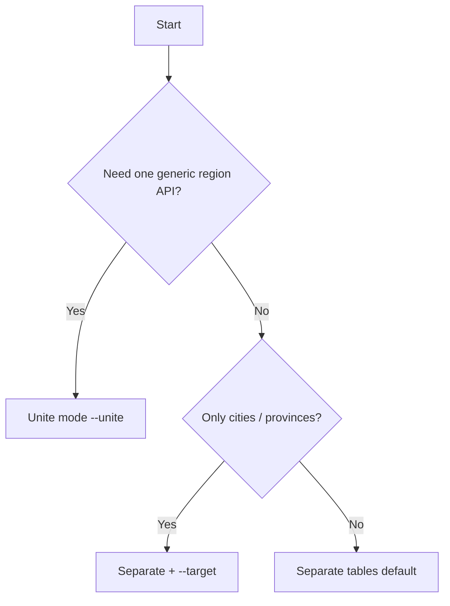

# Storage Modes

[← English docs](./README.md)

Typhoon Iran Cities supports two ways to persist region data. Choose **before** publishing migrations — switching later requires a data migration.

## Separate tables (default)

Each administrative level gets its own table and Eloquent model.

| Level | Table | Model |
|-------|-------|-------|
| Province | `iran_provinces` | `IranProvince` |
| County | `iran_counties` | `IranCounty` |
| Sector | `iran_sectors` | `IranSector` |
| City | `iran_cities` | `IranCity` |
| City district | `iran_city_districts` | `IranCityDistrict` |
| Rural district | `iran_rural_districts` | `IranRuralDistrict` |
| Village | `iran_villages` | `IranVillage` |

### When to use

- You want **strong typing** — `$city->county` returns an `IranCounty`, not a generic row
- Your queries mostly touch **one level** (e.g. city pickers)
- You prefer **normalized FK columns** (`province_id`, `county_id`, …) on each table
- Team familiarity with classic Laravel relation patterns

### Example

```php
use App\Models\IranCity;

$city = IranCity::with('county.province')->find(1);
$city->county->name;
$city->county->province->name;
```

### Commands

```sh
php artisan iran:init --target=cities
# No --unite flag
```

## Unite mode (single table)

All levels share one `iran_regions` table. A `type` enum column distinguishes province from city from village, etc.

| Column | Purpose |
|--------|---------|
| `type` | `province`, `county`, `sector`, `city`, `city_district`, `rural_district`, `village` |
| `parent_id` | Direct parent in the tree |
| `province_id` … `rural_district_id` | Denormalized ancestor FKs for fast filtering |
| `name`, `code`, `short_code`, `status` | Same as separate mode |

Model: **`IranRegion`**

### When to use

- You want **one generic API** for all region types
- Building a **recursive tree UI** or nested-set-like navigation
- Minimizing table count in small projects
- Polymorphic-style queries across all levels

### Example

```php
use App\Models\IranRegion;

// All cities in Tehran province
IranRegion::where('type', 'city')
    ->whereHas('province', fn ($q) => $q->where('code', 'tehran'))
    ->get();

$region = IranRegion::find(1);
$region->children; // direct children
$region->parent;    // direct parent
```

### Commands

```sh
php artisan iran:init --unite --target=all
```

## Comparison

| Aspect | Separate tables | Unite mode |
|--------|-----------------|------------|
| Tables | Up to 7 | 1 |
| Models | Up to 7 | 1 (`IranRegion`) |
| Type safety | Strong per model | Filter by `type` |
| Relations | Dedicated methods per level | Generic `parent()` / `children()` + typed shortcuts |
| `--target` support | Yes | Yes |
| City coordinates | `iran_cities` columns | Columns on `iran_regions` where `type = city` |
| Switching later | Requires ETL | Requires ETL |

## `--target` interaction

`--target` limits **which levels** are published and imported, independent of storage mode.

| `--target` | Levels included |
|------------|-----------------|
| `provinces` | Province |
| `counties` | Province → county |
| `sectors` | Province → sector |
| `cities` | Province → city |
| `city_districts` | Province → city district |
| `rural_districts` | Province → rural district |
| `villages` | Province → village |
| `all` | Everything |

Each target always includes **ancestor levels** required for foreign keys. You cannot import cities without provinces, counties, and sectors.

## Decision guide



## Next steps

- [Commands reference](./commands-reference.md)
- [Models & relationships](./models-and-relationships.md)
