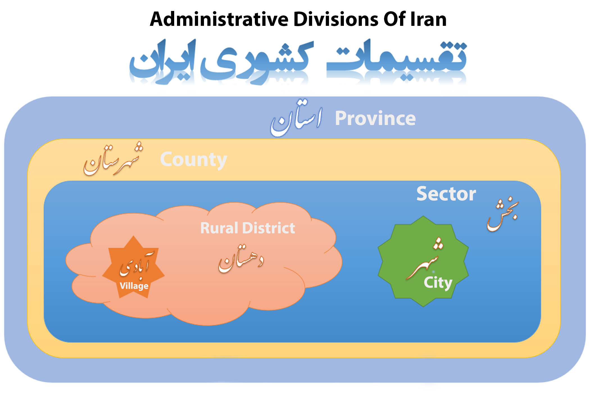

# معرفی

[← مستندات فارسی](./README.md)

**Typhoon Iran Cities** داده‌های تقسیمات کشوری رسمی ایران را به اپلیکیشن لاراول شما درون‌ریزی می‌کند. با یک `composer require`، چند دستور Artisan، دیتابیس شما استان تا آبادی را — همراه با مدل‌های الوکئنت و روابط — در اختیار می‌گذارد.

## چه مشکلی را حل می‌کند؟

ساخت انتخابگر مکان، فرم آدرس، منطقه ارسال، یا گزارش‌های منطقه‌ای برای ایران معمولاً یعنی پیدا کردن فایل CSV، نرمال‌سازی کدها، و اتصال دستی کلیدهای خارجی. این پکیج داده‌های آماده (بر پایه [ahmadazizi/iran-cities](https://github.com/ahmadazizi/iran-cities))، مهاجرت، مدل، و فرآیند درون‌ریزی را فراهم می‌کند تا روی منطق محصول تمرکز کنید.

## سطوح تقسیمات

سلسله‌مراتب ایران به این شکل است:

```
استان
 └── شهرستان
      └── بخش
           ├── شهر
           │    └── منطقه شهری
           └── دهستان
                └── آبادی
```



## ویژگی‌های کلیدی

| ویژگی | توضیح |
|-------|--------|
| **سلسله‌مراتب کامل** | هر هفت سطح با کدهای رسمی |
| **دو استراتژی ذخیره** | جداول مجزا یا جدول واحد `iran_regions` |
| **درون‌ریزی انتخابی** | فقط آنچه نیاز دارید (`--target=cities` و ...) |
| **فایل‌های منتشرشده** | مهاجرت و مدل در پروژه شما — ساختار دیتابیس مال شماست |
| **متدهای کمکی الوکئنت** | محدوده، روابط والد و فرزند، مدیریت وضعیت |
| **مختصات شهر** | عرض و طول جغرافیایی اختیاری برای شهرها |
| **درون‌ریزی مجدد** | `--fresh` برای خالی‌کردن جدول و بارگذاری دوباره |

## این پکیج چه نیست

- ابزار کدگذاری جغرافیایی یا نقشه (مختصات فقط از CSV از پیش آماده برای شهرهاست)
- رابط برنامه‌نویسی آماده — مستقیماً مدل را پرس‌وجو می‌کنید یا نقطه پایانی خودتان را می‌سازید
- جایگزین فهرست رسمی — بازتاب داده‌ای است که توسط جامعه نگهداری می‌شود

## وابستگی پکیج

**مدل‌های منتشرشده** از کلاس‌های `SaliBhdr\TyphoonIranCities\Models\*` ارث می‌برند. **بعد از `iran:publish:models` باید پکیج نصب بماند** — حذف آن اپلیکیشن را از کار می‌اندازد.

**مهاجرت‌های منتشرشده** مستقل هستند و به فضای نام پکیج ارجاع نمی‌دهند.

## گام بعد

- [نیازمندی‌ها و نسخه‌ها](./requirements-and-versioning.md)
- [شروع سریع](./quick-start.md)
